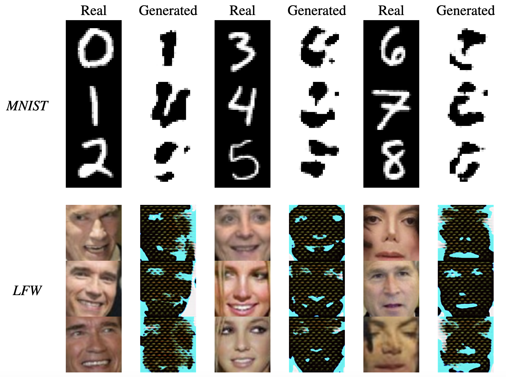

# :framed_picture: :interrobang: Distortion Generator

Neural network for creating distortion while keeping embeddings as close as possible. Part of tbe
research paper under the supervision of Prof. Alexander Kuznetsov.

## :file_folder: Structure

The project is structured as follows:
| File/Folder | Description |
| ----------- | ----------- |
| [`embedding.ipynb`](embedding.ipynb) | Notebook for creating the embedding neural network using Triplet Loss function |
| [`generator.ipynb`](generator.ipynb) | Notebook for training the generator neural network — the central model of our research |
| [`evaluation.ipynb`](evaluation.ipynb) | Notebook for estimating accuracy of proposed models |
| [`models.ipynb`](models) | Folder containing trained models |
| [`images`](images) | Folder containing example images after applying the generator model |
